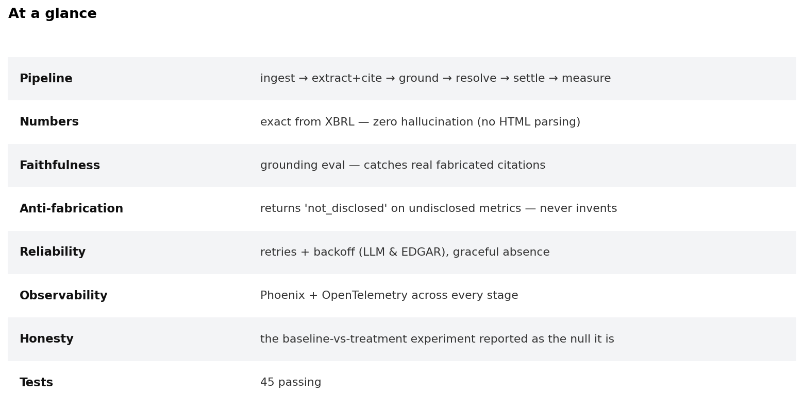
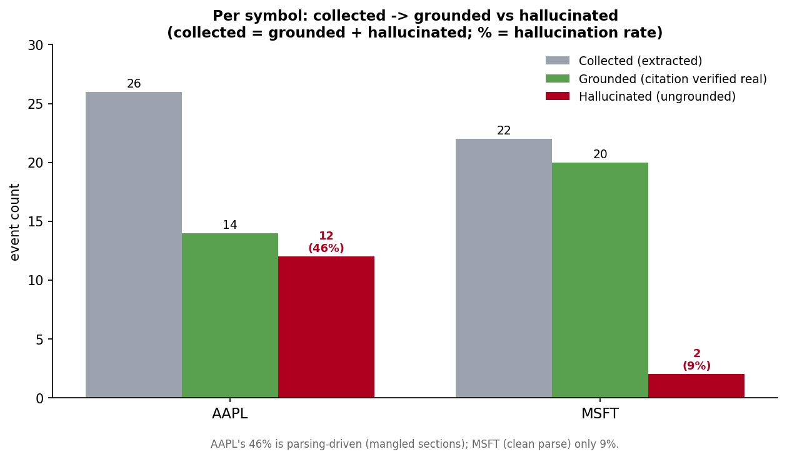
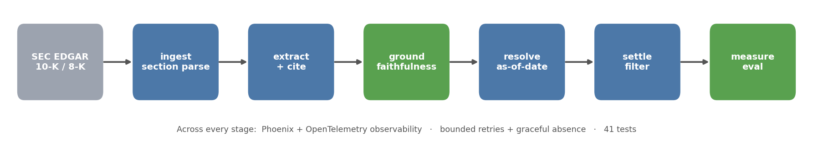

# filing-event-eval

An **agent that extracts events from SEC filings (10-K / 8-K) for event-contract
markets** — each extracted event grounded in a citation back to the source
passage — with a **rigorous evaluation harness** (faithfulness, extraction
accuracy, citation correctness) and full **observability** (Arize Phoenix +
OpenTelemetry).

Built as a learning + portfolio project for AI-evals roles (W&B Weave / Arize /
Galileo). Aligns with regulated-markets + event-contracts domain. **Public data
only (SEC EDGAR); no proprietary content.**

## At a glance




*The faithfulness reality: of what the agent extracts, how much has a **verifiable**
citation vs a **fabricated** one. AAPL's ~46% ungrounded is **parsing-driven** (MSFT,
clean parse: ~9%) — which is exactly why settlement-grade extraction pulls numbers
from **structured XBRL**, not HTML. The grounding eval makes this visible; the gate
refuses to act on it.*

## What this demonstrates
- **Faithfulness / hallucination detection** — every event must carry a citation
  that's *verbatim-verifiable* in the source; ungrounded citations are flagged.
  (Caught a real fabrication: a filing presented a tax rate as a **table**, the model
  invented a **prose sentence** explaining it — flagged by a $0 string-match.)
- **Anti-fabrication** — asked for a metric a company *stopped disclosing* (Apple's
  iPhone unit sales, since 2018), the system returns `not_disclosed`, never a number.
  ([docs/ARTIFACTS.md](docs/ARTIFACTS.md))
- **Production reliability** — graceful absence handling, **bounded retries with
  backoff** at the LLM *and* EDGAR layers, failures recorded as *measured, traced*
  signals. ([docs/RELIABILITY.md](docs/RELIABILITY.md))
- **Observability** — Phoenix + OpenTelemetry spans across every stage and every
  LLM call (prompt, tokens, latency).
- **Honest evaluation** — a controlled baseline-vs-treatment experiment reported as
  the **null it is**: section-aware extraction did *not* improve faithfulness, and
  its coverage edge is a *truncation artifact* (n=2). ([docs/EXPERIMENT.md](docs/EXPERIMENT.md))

The throughline: **building filing-extraction agents whose behavior is measured,
traced, and reported truthfully — including when the result is a null.**

## The task
Given a company's 10-K (or 8-K), the agent identifies the **events** described —
material events, risk factors, and forward-looking statements — and for each
returns:
- a short **event statement** (e.g. "Company expects to close the X acquisition by Q3"),
- a **citation** (the exact source passage it came from),
- a **type** (material event / risk factor / forward-looking),
- (later) a **binary resolvable form** for event contracts ("Will X close by Q3?") + a confidence.

The point isn't the extraction — it's **measuring whether the extraction is
grounded and correct**, which is the hard, valuable part.

## Architecture


*Numbers come from **XBRL** (exact, zero-hallucination); the LLM handles only the
narrative, behind the grounding gate.*

## Eval harness (the differentiator)
1. **Grounding / faithfulness** — every extracted event must map to a real passage; fabricated events are flagged (the hallucination metric these companies sell).
2. **Extraction precision / recall** — vs a small hand-labeled reference set (or a stronger model as silver reference).
3. **Citation accuracy** — does the cited span actually support the event? (entailment check, LLM-judge.)
4. **(Extension) Event-contract calibration** — events → binary "will it happen?" questions; score stated confidence vs realized outcome over time (Brier score / calibration curve). This isolates decision quality from noise.

## What we extract — and what happens when it's missing
The value is in *specific typed artifacts*, and the reliability question is **what
happens when the one you want isn't there.** Each artifact has a **defined absence
behavior**, and every failure is a **measured, traced signal** — it flows into the
same Phoenix/OpenTelemetry spans and eval metrics as everything else, never silent
and never fabricated.

| Artifact | When present | When missing / wrong |
|---|---|---|
| **Quantitative fact** (e.g. "revenue up") | value + unit + period + **grounded citation** | not in filing → `not_disclosed` (never invented); no unit/period → `incomplete`; in a table → `low_confidence` |
| **Forward-looking commitment** | claim + deadline + settlement source | no deadline → `not_settleable`; vague/conditional → `low_settleability` |
| **Entity / issuer** | CIK + ticker, resolved **as-of the filing date** | ambiguous → candidates (never guess); old filing → `asof_risk` |
| **Legal / regulatory** | matter + status | open outcome → flagged, kept as an open question |

**Anti-fabrication, proven on real data:** asked for Apple's *iPhone unit sales*
(which Apple stopped disclosing in 2018), the system returns **`not_disclosed`** —
and won't surface even a famous number unless it's grounded in the text. Asked for
*R&D expense*, it returns the grounded figure (`34,550`, FY25).

→ Full detail: **[docs/ARTIFACTS.md](docs/ARTIFACTS.md)** (artifacts + absence handling) ·
**[docs/RELIABILITY.md](docs/RELIABILITY.md)** (failures as measured signals).

## Measuring recall — a human-verified gold set
Grounding measures **precision** ("are the citations real?"). It does *not* measure
**recall** ("did we find everything that's there?"). Recall needs a **reference list**
of every event that *should* be found — a gold set — and how you build it matters:

**The trap:** if an AI builds the gold set, you're doing *AI grading AI* — and if the
reference model shares the system's blind spots, they miss the same buried events and
recall looks **falsely perfect**. An unverified AI gold set is worthless.

**The workflow** (`scripts/build_gold_set.py`):
1. **AI drafts** — exhaustively lists candidate events + citations (the word-by-word grunt work).
2. **A human verifies** — keep/drop, fix citations, **add** anything missed. *That pass breaks the circularity.*
3. **Match granularity** — the reference must define "an event" the *same way* as the
   system (atomizing every table cell into 156 items vs the system's 26 consolidated
   events makes recall meaningless).
4. **Compute precision *and* recall** against the verified gold.

**Caveat (state it):** even human+AI can miss a deeply-buried item, so recall is "vs the
best reference we could assemble," not vs omniscience.

*Status: an AI-drafted AAPL gold set exists (`reports/gold/`), pending a
granularity-matched re-draft + human verification.*

## Build slices
- [x] **Slice 1 — EDGAR ingest:** fetch a 10-K from EDGAR (ticker → CIK → latest), section-aware parse by Item. *(Deterministic — vector store deferred until cross-filing queries justify it.)*
- [x] **Slice 2 — extraction:** cited per-section event extraction (treatment) + naive baseline (control).
- [x] **Slice 3 — eval + observability:** faithfulness (grounding rate) + Phoenix/OTel tracing across the pipeline.
- [x] **Slice 4 — entity resolution + reliability + typed artifacts:** as-of-date entity resolution (ambiguous/unresolved/drift flags), a reliability/orchestration plan (`docs/RELIABILITY.md`), and typed-artifact lookup with **anti-fabrication** — `not_disclosed` vs grounded values (`docs/ARTIFACTS.md`).
- [x] **Slice 5 — settleability filter + baseline-vs-treatment experiment:** [**docs/EXPERIMENT.md**](docs/EXPERIMENT.md). **An honest null** (n=2): section-aware extraction did *not* improve faithfulness (grounding ~tied), and its coverage edge is largely a *truncation artifact*. Settleability ≈ 0 (most filing statements are risk/historical, not contractable). The value is the eval + anti-fabrication + reliability around it — and the discipline to call a null a null.
- [x] **Slice 6 — XBRL numeric path (the settlement-grade fix):** quantitative facts pulled from SEC **XBRL** (exact, zero-hallucination — verified: AAPL R&D = `34,550,000,000`, revenue = `416,161,000,000`, FY2025); the LLM handles only narrative, behind the grounding gate. *(fixes the parsing-driven number hallucination diagnosed in Slice 5.)*

## Stack
Python · Anthropic Claude (SDK) · Chroma · sentence-transformers · **Arize Phoenix + OpenTelemetry** · LLM-as-judge evals.

## Quickstart (WSL / Linux / macOS)
```bash
python3 -m venv .venv && source .venv/bin/activate   # or: uv venv && source .venv/bin/activate
pip install -e ".[dev]"       # installs `rageval` (+ pytest) — no PYTHONPATH needed
cp .env.example .env          # add ANTHROPIC_API_KEY and your SEC_USER_AGENT

# Traced pipeline: ingest -> cited extraction -> faithfulness eval
python -m rageval.pipeline --ticker AAPL --sections 3
```

## Learn the tracing (read this while it runs)
A **span** is one timed unit of work with attributes (inputs/outputs/metadata).
This pipeline emits spans for each stage (`ingest`, `extract`, `extract.section`,
`eval.faithfulness`) and — via the Anthropic instrumentation — **one span per
Claude call** (prompt, token counts, latency).

- **Raw view (always on):** spans print to your terminal as JSON the moment they
  finish — exactly what an observability tool ingests.
- **Visual view (Phoenix UI):** add `PHOENIX=1` to see the same traces at
  **http://localhost:6006** (a tree of nested spans + the LLM I/O). On WSL, open
  that URL in your Windows browser.

```bash
PHOENIX=1 python -m rageval.pipeline --ticker AAPL --sections 3
```
Look at the root `pipeline` span, its `extract.section` children, and the nested
**Claude call** spans inside them — that nesting *is* the agent's execution path.

## Running the tests
```bash
pytest -q     # offline; no API key needed
```
*Learning + portfolio project — public, SEC EDGAR data only, no proprietary content.*
