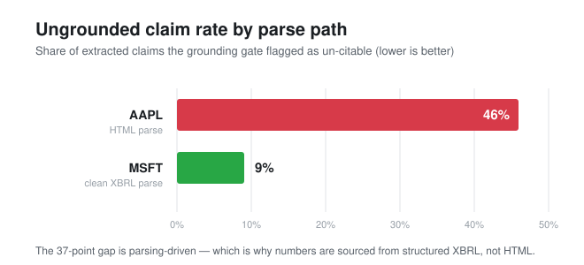

# filing-event-eval

> **📊 Measure** · part 2 of a 3-part series on measuring & governing AI in regulated domains —
> [🔎 Validate](https://github.com/stephendchu/agentic-test-eval) · **Measure (here)** · [🛡 Govern](https://github.com/stephendchu/assay)

## The problem

Companies file mandatory disclosures with the SEC — earnings releases, material events, risk factors. These documents are long, messy, and full of information that matters for decisions. An AI agent can read them quickly. The hard part is knowing when to trust what it extracted.

A confident fabrication is worse than no answer at all. If an AI says Apple's iPhone unit sales were X — and Apple stopped reporting that number in 2018 — that's not a hallucination caught after the fact, that's a system that never should have answered.

**On real EDGAR filings, the grounding gate flagged 46% of AAPL claims as un-citable (HTML parse) versus 9% on MSFT (clean XBRL parse) — the gap that decides whether you can trust the output.**



## What this builds

An SEC filing extraction agent with a rigorous evaluation harness: every claim the model makes must be traceable to verbatim evidence in the source document. Claims that can't be traced are flagged and blocked before they reach any downstream system.

**Two real examples from the actual output:**

- A filing presented a tax rate in a **table**. The model invented a **prose sentence** about it — flagged by a `$0` string-match check. No table row, no answer.
- Asked for Apple's iPhone unit sales: the system returns `not_disclosed` — because Apple stopped reporting that metric in 2018, and the source doesn't contain it. A famous number that everyone knows is still not returned unless it's grounded in *this filing*.

## What I found

- **Faithfulness / hallucination rate** — of what the agent extracts, how much has a verifiable verbatim citation vs a fabricated one (the 46% vs 9% above). The gap is parsing-driven — which is why numbers come from structured XBRL, not HTML.
- **Anti-fabrication** — `not_disclosed` behavior verified on real EDGAR filings. Full detail: [docs/ARTIFACTS.md](https://github.com/stephendchu/filing-event-eval/blob/main/docs/ARTIFACTS.md)
- **Production reliability** — bounded retries with backoff at the LLM *and* EDGAR layers; every failure a measured, traced signal — never silent, never fabricated. [docs/RELIABILITY.md](https://github.com/stephendchu/filing-event-eval/blob/main/docs/RELIABILITY.md)
- **Observability** — every pipeline stage and every Claude call is captured as an OpenTelemetry span (prompt, tokens, latency) and read in **Arize Phoenix** at http://localhost:6006 (`PHOENIX=1`). Instrumentation is **OpenInference** on the Anthropic SDK — open-standard spans, with a console exporter always on as a fallback. Built on standards, not glue code.
- **Honest null** — a controlled baseline-vs-treatment experiment reported as the null it is: section-aware extraction did *not* improve faithfulness, and its coverage edge is a truncation artifact (n=2). [docs/EXPERIMENT.md](https://github.com/stephendchu/filing-event-eval/blob/main/docs/EXPERIMENT.md)

## The grounding gate

Every extracted event must cite a verbatim span from the filing. No citation = blocked:

1. LLM extracts events with citations
2. A `$0` string-match check verifies each citation exists in the source
3. Unverifiable citations are flagged — never silently passed through
4. Genuinely absent metrics return `not_disclosed`, not an invented value

## Quickstart

```bash
python3 -m venv .venv && source .venv/bin/activate
pip install -r requirements.txt
cp .env.example .env   # add ANTHROPIC_API_KEY and SEC_USER_AGENT

# Traced pipeline: ingest → cited extraction → faithfulness eval
PYTHONPATH=src python -m rageval.pipeline --ticker AAPL --sections 3

# With Phoenix UI at http://localhost:6006
PHOENIX=1 PYTHONPATH=src python -m rageval.pipeline --ticker AAPL --sections 3

# Tests run offline, no API key needed
PYTHONPATH=src python -m pytest tests/ -q
```

## Layout

```
src/rageval/
  pipeline.py      # end-to-end: ingest → extract → eval
  grounding.py     # citation verification (the faithfulness gate)
  artifacts.py     # typed artifact lookup with not_disclosed behavior
  reliability.py   # retry, backoff, failure as measured signal
  eval.py          # gold set, precision/recall, bootstrap CIs
```

Full docs: [docs/](https://github.com/stephendchu/filing-event-eval/tree/main/docs) — artifact absence handling, reliability plan, eval design.

*Public / synthetic data only. SEC EDGAR public filings.*
