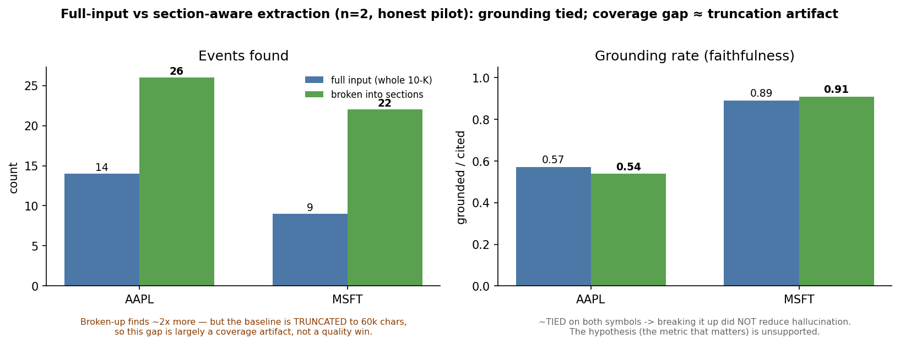

# Experiment: naive whole-filing vs section-aware extraction

**Pilot, n = 2 filings (AAPL, MSFT). Directional — not conclusive at this scale;
the value here is the controlled design and the honest read, not the magnitude.**

## The metric: grounding (a.k.a. faithfulness)
When the model extracts an event it must attach a **citation** — a quote it claims
came from the filing. **Grounding** verifies that quote is real: normalize
whitespace/case, then check it's a **verbatim substring** of the source. Real →
grounded; not found → ungrounded (paraphrased or fabricated). **Grounding rate** =
fraction of cited events whose citation actually appears in the source. It's the
cheapest, most objective hallucination check — no LLM judge, just string matching.

## The two arms (one variable changes: *how* the filing is read)
- **Baseline (control)** — *naive whole-filing*: dump the entire 10-K (truncated to
  ~60k chars to fit context) into one prompt; ask for all events + citations. One shot.
- **Treatment** — *section-aware*: parse the 10-K into its Items, then extract from
  each section separately (a focused prompt per section).

## Hypothesis — what we expected, and why
1. **Better grounding** (focused context → less fabrication): quoting from one short
   section should be more accurate than quoting from a giant truncated blob.
2. **More coverage** (no truncation): the baseline never sees most of the filing;
   the treatment walks every section.

## Results



*Columns = method (full input vs broken into sections); rows = the two symbols.*

| Symbol | Full input (whole 10-K) | Broken into sections |
|---|---|---|
| **AAPL** | 14 found · 8 grounded · **0.571** | 26 found · 14 grounded · **0.538** |
| **MSFT** | 9 found · 8 grounded · **0.889** | 22 found · 20 grounded · **0.909** |
| **Settleable candidates** | — | **0** (both) |

## Findings (honest)
- **Faithfulness (grounding) — no effect.** Grounding was ~**tied** on both symbols
  (0.57↔0.54, 0.89↔0.91). The hypothesis that section-aware extraction hallucinates
  *less* is **unsupported** — breaking it up didn't make it more faithful.
- **Coverage — more events, but largely a *confound*.** The broken-up arm found ~2×
  more events, but the baseline is **truncated to 60k chars**, so most of that gap is
  just *content the baseline couldn't see* — a mechanical artifact of the truncation
  choice, **not** evidence the method is smarter.
- **Settleability = 0 — and it's real.** Spot-checking the rejects validated the
  filter: the extracted events are **risk factors** ("margins *may* face volatility"
  — not binary, no deadline) and **historical facts** ("R&D *increased* 10%" — already
  happened, not a future event). Most 10-K statements simply **aren't contractable**.
- **n = 2** — nothing here is statistically significant; this is a directional pilot.

## Worked example: a hallucination grounding caught
On Apple's Item 1A, the model extracted *"Apple's effective tax rate decreased
significantly from 24.1%…"* with the citation *"The Company's effective tax rate
for 2025 was lower compared to 2024 **due to a**…"*. But the filing presents the tax
rate as a **table of numbers** — *"…effective tax rate … for 2025, 2024 and 2023 were
as follows (dollars in millions): 2025 2024 2023 …"*. The model **invented a prose
explanation that isn't in the document.** The verbatim grounding check returned
**False → flagged** — a $0 string-match catching a genuine fabrication. Across two
Apple sections grounding caught **4 of ~15** events this way (the filing had a table;
the model wrote a sentence).

*Nuance:* the check is **strict/verbatim**, so it also flags lightly-paraphrased
quotes that are *semantically* supported — making grounding a high-precision
faithfulness **floor** (a softer "is the claim supported?" entailment check, which
needs a judge, sits one level up).

## The insight
Generic extraction pulls *risk + historical* events, which are structurally
non-settleable. **To source event-contract candidates, extraction must specifically
target forward-looking, *dated* statements.** Acting on that is what turns
valid-candidate-yield from 0 into real candidates — the next iteration.

## The takeaway
This is an **honest null on the headline hypothesis.** Section-aware extraction did
*not* improve faithfulness, and its coverage edge is mostly a **truncation artifact**,
not a smarter method. The *right* next experiment **controls for truncation** (give
both arms the same content) to test whether structure helps independent of just
seeing more. Reporting this straight — instead of spinning "2× more!" — is the point:
a reviewer trusts the *next* claim because this one was reported honestly. The
project's value isn't "section-aware wins"; it's the **faithfulness eval,
anti-fabrication, and reliability** around it — and the discipline to call a null a null.

## Caveats
n = 2, single fiscal period; grounding is a strict *verbatim* check (no judge bias,
but it doesn't credit semantically-supported paraphrases); section parsing is
MVP-grade. Scale to ~10 filings + a forward-looking-targeted extractor next.

## Reproduce
```bash
PYTHONPATH=src python scripts/run_experiment.py --tickers AAPL MSFT --sections 3
```
